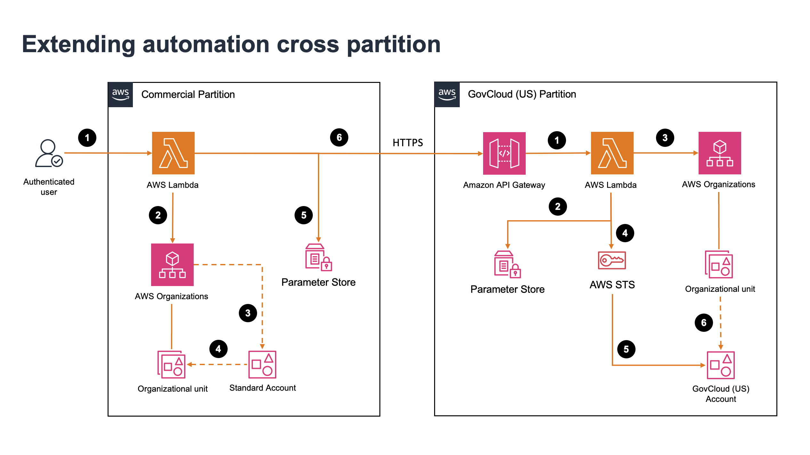

# Extending Automation Cross Partition

Companion code for the AWS Public Sector Blog post: **"Automate Cross-Partition AWS GovCloud (US) Account Bootstrapping"**

## Overview

This solution automates the post-creation bootstrapping workflow for AWS GovCloud (US) accounts. It extends the approach introduced in [Automate AWS GovCloud (US) account creation using AWS Organizations APIs](https://aws.amazon.com/blogs/publicsector/automate-aws-govcloud-us-account-creation-using-aws-organizations-apis/) by automating the remaining steps: inviting the new account to a GovCloud organization, accepting the invitation, and placing it in the correct organizational unit (OU).

> **Note:** The code in this repository has been updated and improved from what is shown in the [original blog post](https://aws.amazon.com/blogs/publicsector/automate-aws-govcloud-us-account-creation-using-aws-organizations-apis/). Changes include enhanced polling logic, dry run support, and additional error handling. Use this repository as the source of truth for the latest version.

## Architecture



The solution spans both AWS partitions:

- **Commercial partition** — A Lambda function creates the GovCloud account via AWS Organizations, moves the commercial paired account to a specified OU, and sends the GovCloud account details to the GovCloud partition over HTTPS.
- **GovCloud (US) partition** — An API Gateway receives the request, a Lambda function validates it, invites the account to the organization, accepts the invitation via STS role assumption, and moves it to the target OU.

## Repository Structure

```
.
├── commercial-partition/
│   ├── create_resources_commercial.yaml          # CloudFormation template to create all commercial resources
│   ├── lambda_function_commercial.py             # Lambda function
│   ├── lambda_permission_policy_commercial.json  # permission policy for Lambda role
│   ├── lambda_trust_policy_commercial.json       # trust policy for Lambda role
│   └── ReadMe.md                                 # Read me file
├── govcloud-partition/
│   ├── apig_gc.yaml                              # API Gateway
│   ├── create_resources_gc.yaml                  # CloudFormation template to create all GC resources
│   ├── lambda_function_gc.py                     # Lambda function
│   ├── lambda_permission_policy_gc.json          # permission policy for Lambda role
│   ├── lambda_trust_policy_gc.json               # trust policy for Lambda role
│   └── ReadMe.md                                 # Read me file
├── gc_account_bootstrapping.png                  # architecture diagram
├── LICENSE                                       # License file
└── README.md                                     # this file
```

## Prerequisites

- AWS Organizations enabled in both commercial and GovCloud (US) partitions
- Access to Management Account in both commercial and GovCloud partitions
- Shared API key stored in AWS Systems Manager Parameter Store (**must be created in both partitions** — see below)

### SSM Parameter Store (Required in Both Partitions)

The same API key must be stored as a SecureString parameter in **both** partitions. The commercial Lambda uses it to authenticate requests to the GovCloud API Gateway, and the GovCloud Lambda uses it to verify incoming requests.

**Commercial partition:**
```bash
aws ssm put-parameter \
  --name "cross_partition_api_key" \
  --type SecureString \
  --value "<your-shared-api-key>" \
  --region us-east-1 \
  --profile <your-commercial-profile>
```

**GovCloud (US) partition:**
```bash
aws ssm put-parameter \
  --name "cross_partition_api_key" \
  --type SecureString \
  --value "<your-shared-api-key>" \
  --region us-gov-west-1 \
  --profile <your-govcloud-profile>
```

> **Note:** Both partitions use the same parameter name (`cross_partition_api_key`). Ensure both store the same secret value. The value should be a strong, randomly generated string (e.g., `openssl rand -base64 32`).

## Deployment

The CloudFormation templates in each folder deploy all required resources (Lambda, IAM roles, API Gateway) in a single stack. This is the recommended approach.

If you prefer to create resources manually (e.g., via the console or individual CLI commands), refer to the `ReadMe_gc.md` and `ReadMe_commercial.md` files in each subfolder for step-by-step instructions.

### Step 1: Deploy GovCloud (US) resources

Deploy the CloudFormation stack in the GovCloud partition first. This creates the API Gateway endpoint, Lambda function, and IAM role.

```bash
aws cloudformation deploy \
  --template-file govcloud-partition/create_resources_gc.yaml \
  --stack-name process-new-gc-acct \
  --capabilities CAPABILITY_NAMED_IAM \
  --region us-gov-west-1 \
  --profile <your-govcloud-profile>
```

### Step 2: Obtain the API Gateway endpoint

After the GovCloud stack deploys, retrieve the API Gateway endpoint URL from the stack outputs:

```bash
aws cloudformation describe-stacks \
  --stack-name process-new-gc-acct \
  --query "Stacks[0].Outputs[?OutputKey=='ApiEndpoint'].OutputValue" \
  --output text \
  --region us-gov-west-1 \
  --profile <your-govcloud-profile>
```

The output will look like: `https://<api-id>.execute-api.us-gov-west-1.amazonaws.com/ingest`

### Step 3: Deploy commercial partition resources

Use the API Gateway endpoint from Step 2 to deploy the commercial stack:

```bash
aws cloudformation deploy \
  --template-file commercial-partition/create_resources_commercial.yaml \
  --stack-name create-gc-acct \
  --parameter-overrides \
    GcApiEndpoint=https://<api-id>.execute-api.us-gov-west-1.amazonaws.com/ingest \
  --capabilities CAPABILITY_NAMED_IAM \
  --region us-east-1 \
  --profile <your-commercial-profile>
```

> **Note:** The `--region` and `--profile` parameters in all CLI commands are optional. They can be omitted if your AWS CLI is already configured with the correct default region and profile (e.g., via `AWS_DEFAULT_REGION`, `AWS_PROFILE` environment variables, or `~/.aws/config`). Update or remove them as needed for your environment.

## Usage

After deployment, invoke the commercial Lambda function to create a new GovCloud account.

We recommend starting with a **dry run** to validate cross-partition connectivity before creating any accounts.

**Dry run example** (tests cross-partition connectivity without creating an account):

```bash
aws lambda invoke \
  --function-name create_gc_acct \
  --payload '{
    "dry_run": true,
    "test_account_id": "111122223333",
    "account_name": "DryRunTest",
    "govcloud_target_ou": "Sandbox"
  }' \
  --cli-binary-format raw-in-base64-out \
  --region us-east-1 \
  --profile <your-commercial-profile> \
  output.json

cat output.json
```

Once the dry run succeeds, perform a production run to create the account:

```bash
aws lambda invoke \
  --function-name create_gc_acct \
  --payload '{
    "email": "team-govcloud@example.com",
    "account_name": "New-GovCloud",
    "commercial_target_ou": "GovCloud-Paired",
    "govcloud_target_ou": "Workloads/Sandbox"
  }' \
  --cli-binary-format raw-in-base64-out \
  --cli-read-timeout 180 \
  --region us-east-1 \
  --profile <your-commercial-profile> \
  output.json
```

**Parameters:**

| Parameter | Description |
|-----------|-------------|
| `email` | Unique email for the new GovCloud account |
| `account_name` | Name for the new account |
| `commercial_target_ou` | OU path for the commercial paired account (e.g., `GovCloud-Paired`) |
| `govcloud_target_ou` | OU path for the GovCloud account (e.g., `Workloads/Sandbox`) |
| `dry_run` | *(optional)* Set to `true` to test connectivity without creating an account |

> **Note:** The `--cli-read-timeout 180` flag is required for non-dry-run invocations. The function waits 60 seconds before its first status check, then polls until the account is ready — typically 70–110 seconds total. This exceeds the CLI's 60-second default, so without the flag the CLI times out even though the Lambda completes successfully. The value is an upper bound, not a fixed delay; the CLI returns as soon as the function responds.

## License

This library is licensed under the MIT-0 License. See the [LICENSE](LICENSE) file.
